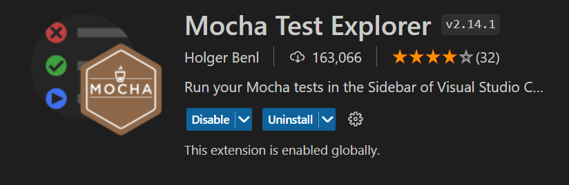
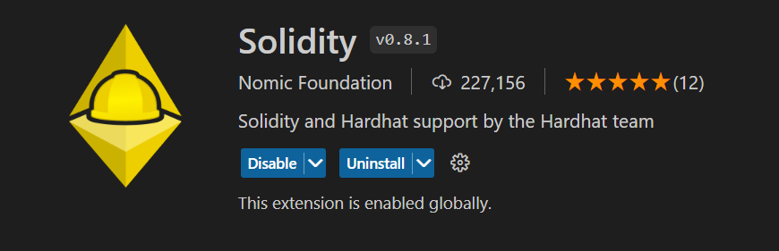

### Open Zeppelin Contracts

***Clone it***
https://github.com/OpenZeppelin/openzeppelin-contracts

Open Zeppelin writes smart contracts used by many.

### Getting started with Hardhat
```sh
npm i --save-dev hardhat
```
```sh
npx hardhat init
> Create a TypeScript Project with Viem
all others you can do yes
```
if you installl with bun remove typpe: module from package.json

test hardhat compile working using

```npx hardhat compile```

abi is generated in ./artifacts/contrats/fil_name.sol/file_name.json

Extension for course
* Mocha Text Explorer
* hardhat

create .mocharc.json and add this
```json
{
    "require": "hardhat/register",
    "timeout": 40000,
    "_": ["test*/**/*.ts"]
}
```
require says where to get the file , timeout for the tests and ***"_"*** path to find the test file in 

viem only knows if youu compiled the contract which contact to write after viem.deployContract.
If you do npx hardhat clean then there is no 
